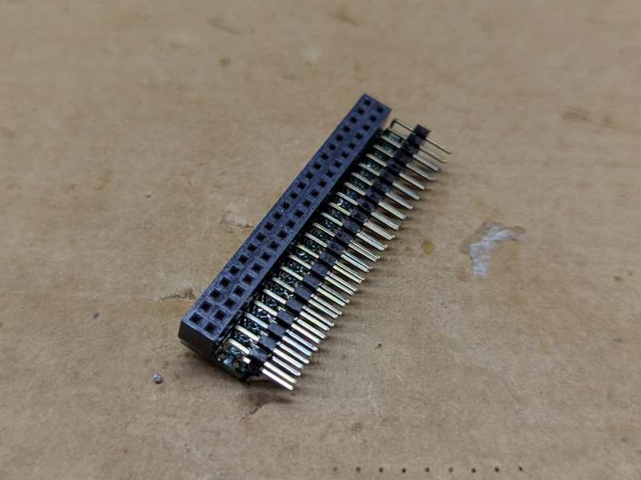
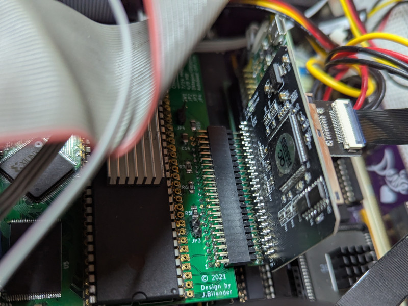

# Angled 44 pin 2.0mm pitch adapter

## DISCLAIMER

Any use of this project is **under your own responsibility**.
You will be responsible of checking the correct construction and functionality of your board.
By using this project You will agree that I cannot be held responsible if it will destroy any of your devices, damage your computer, burn down your house or whatever.

## Introduction

I was in need of fitting a uSD to IDE adapter inside a cramped case, the connector for it was horizontal, but the only space left was in the vertical direction.
So I made this adapter.

Fundamentally, it is meant to angle a 2x22 pin, 2.0mm pitch connector by 90 degrees,

### Ordering the boards

You can order the board for this project at [PCBWay](https://www.pcbway.com/project/shareproject/PLACEHOLDER.html) and support me or download 
the gerbers and have them printed wherever you like!!!

## Hardware

The board was designed with [KiCad](https://kicad.org/) EDA.

### Bill of Materials

This board uses mostly SMD components, but the large footprint allows for handsoldering.

| Component              | Qty | Type / Value                              | Notes                                                                |
| ---------------------- | --- | ----------------------------------------- | -------------------------------------------------------------------- |
| J1                     |  1  | 2x22 pin header, 2.0mm pitch, right angle |                                                                      |
| J2                     |  1  | 2x22 pin socket, 2.0mm pitch, straight    |                                                                      |
